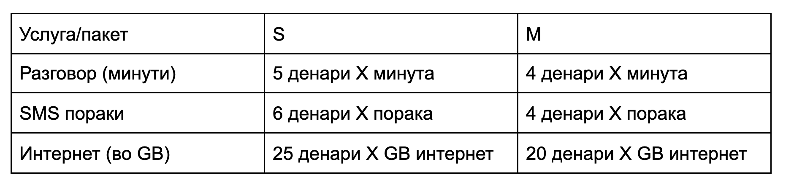

Потребно е да се развие апликација за чување на информации за месечните сметки на корисниците на еден мобилен оператор. Мобилниот оператор нуди 2 типа на пакети на своите корисници: `S` и `M` пакет. Во пакетот `S` корисникот во рамки на еден месец има бесплати 100 минути разговор, 50 СМС пораки и 5 GB интернет, додека пак во пакетот `M` корисникот има бесплатни 150 минути, 60 СМС пораки и 10 GB интернет. Основната цена на пакетот `S` е `500` денари, додека пак основната цена на пакетот `M` е `750` денари.

Во операторот работат претставници за продажба (sales reps) коишто се одговорни за клиентите кои тие ги вовеле во операторот и соодветно добиваат одредена провизија (commision) за секоја месечна сметка на своите клиенти.

За таа цел дефинирајте класа `MobileOperator`со следните методи:

*   Конструктор без аргументи `MobileOperator()`
*   Метод `void readSalesRepData (InputStream is)` - метод за вчитување на месечните извештаии за клиентите на sales reps. Во секој ред се дадени информациите за еден sales rep во следниот формат: `salesRepID [customerBill1] [customerBill2] … [customeBillrN]`. Форматот на информациите за секој сметка е следен: `customerID package_type count_of_minutes count_of_SMS count_of_data_in_GB`, каде што `package_type` е еден карактер `S` или `М` што го означува типот на пакетот. Бројот на потрошени минути и пораки е цел број, додека бројот на потрошен интернет може да биде и децимален број. Сите информации во рамки на една линија се одделени со празно место.
    *   ID на еден sales rep содржи точно 3 знаци (сите се цифри), додека пак ID на клиент содржи точно 7 знаци (сите се цифри). Да се фрли исклучот од тип `InvalidIdException` доколку некој клиенt или sales rep имаат невалиден ID. Доколку станува збор за клиент, сметката на тој клиент да се игнорира. Доколку станува збор за sales rep да се игнорира целиот негов извештај. Да се испечати порака при фаќање на исклучокот. Форматот на пораките е во вториот и третиот тест пример.
*   методот `void printSalesReport (OutputStream os)` - методот за печатење на извештаите за sales representatives. Извештајот за еден sales rep e во следниот формат `ID number_of_bills min_bill average_bill max_bill total_commission`. Под bill се подразбира износот на сметката на некој клиент.

    *   На сликата подолу е дадено колку чини секоја услуга над бесплатните услуги. Сметката на даден клиент се пресметува така што се собира основната цена на пакетот со дополнителните трошоци направени како резултат на надминување на бесплатните минути/пораки/GB интернет.
    *   Еден sales rep добива провизија `4%` од сметката на корисник на пакет `M` и `7%` од сметката на корисник на пакет `S`.
    *   Извештаите да бидат испечатени сортирани во опаѓачки редослед според провизијата на sales rep-от.

